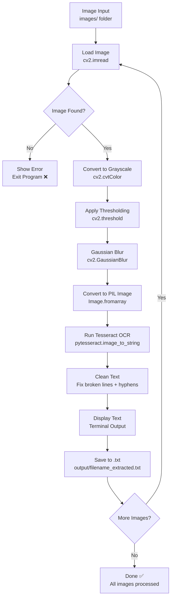

# Assignment 4(B) – OCR Text Extractor

---

## Project Overview
 
Complete OCR (Optical Character Recognition) system using **Python**, **OpenCV**, and **Tesseract OCR**.
Takes images from `images/` folder → preprocesses → extracts printed text → cleans output → saves result automatically:
 
| Output | Meaning |
|--------|---------|
| 📄 filename_extracted.txt | Extracted text saved per image in output/ folder |
| 🖥️ Terminal Output | Extracted text displayed in clean format |
| ✅ Auto Folders | `images/` and `output/` folders auto-created on run |
| 🔁 Multi-Image Support | All images in folder processed automatically |
| 🧹 Clean Text | Broken/wrapped lines auto-joined |
 
---
 
## Project Structure
 
```
OCR-Text-Extractor/
│
├── images/                         ← Add your images here (any name)
│   └── sample image.png
│
├── output/                         ← Auto-generated on run
│   └── sample image_extracted.txt
│
├── main.py                         ← Main Python script
├── requirements.txt                ← Required libraries
└── README.md                       ← This file
```
 
---
 
## Technologies Used
 
| Tool | Purpose |
|------|---------|
| Python 3.x | Core programming language |
| OpenCV (cv2) | Image loading and preprocessing |
| pytesseract | Python wrapper for Tesseract OCR |
| Pillow (PIL) | Image format conversion |
| Tesseract OCR | OCR engine by Google |
 
---
 
## OCR Pipeline
 

 
---

## Setup & Installation
 
### Step 1 — Install Python Libraries
 
```bash
pip install -r requirements.txt
```
 
### Step 2 — Install Tesseract OCR (Windows)
 
1. Download installer: https://github.com/UB-Mannheim/tesseract/wiki
2. Install to: `C:\Program Files\Tesseract-OCR\`
3. Add to PATH:
   - Press `Windows + R` → type `sysdm.cpl` → press Enter
   - Go to **Advanced** tab → click **Environment Variables**
   - Under **System Variables** → find **Path** → click **Edit**
   - Click **New** → paste: `C:\Program Files\Tesseract-OCR`
   - Click **OK → OK → OK**
### Step 3 — Verify Installation
 
```bash
tesseract --version
```
 
### Step 4 — Add Images
 
Place any JPG/PNG images inside `images/` folder — **no renaming needed!**
 
### Step 5 — Run Project
 
```bash
python main.py
```
 
---

## Screenshots
 
### Sample Input Image
> Add your sample input image screenshot here
> Example: ``
 
### Extracted Text Output
> Add your extracted text output screenshot here
> Example: ``
 
---

## Conclusion
 
This project demonstrates a complete OCR pipeline using Python, OpenCV, and Tesseract OCR. The system loads images, preprocesses them (grayscale, threshold, denoise), extracts text, cleans broken lines, and saves individual .txt files while supporting multiple images automatically.
 
---